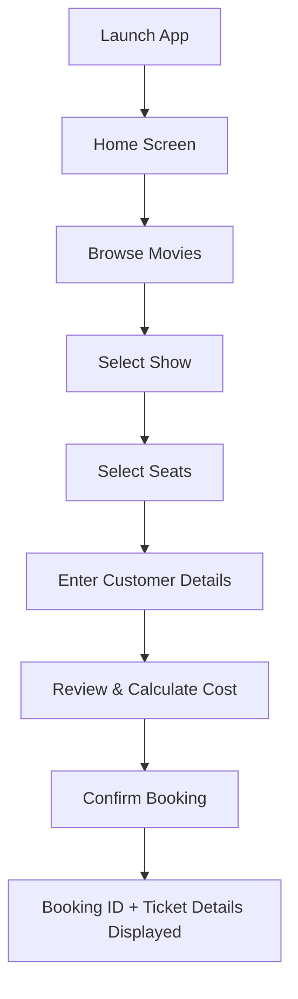

# 🎬 Movie Ticket Booking System — Project Overview

## Project Name
**Movie Ticket Booking System** (Java Desktop Edition)

## Purpose
A single-user Java desktop application that automates the process of browsing movies, selecting a show, choosing seats, and confirming a booking — replacing manual/paper-based booking with a fast, error-free digital flow. Built as an academic project to demonstrate core Java OOP concepts through a realistic domain.

## Problem Being Solved
Manual booking is slow and error-prone (double-booked seats, manual price calculation, no record of bookings). This system automates seat availability tracking, cost calculation, and booking confirmation, and persists all data so nothing is lost between sessions.

## What the Application Does
1. Displays available movies with genre and price
2. Lets the user pick a show (theatre + time)
3. Shows a live seat grid (booked seats disabled)
4. Collects customer name/phone
5. Calculates total cost
6. Confirms the booking with a unique Booking ID
7. Persists everything in SQLite — safe across restarts

## Main Features
| Feature | Status |
|---|---|
| Browse movies | Planned — Phase 6 |
| Show/theatre selection | Planned — Phase 6 |
| Seat grid selection | Planned — Phase 7 |
| Duplicate seat prevention | Planned — Phase 5 |
| Cost calculation | Planned — Phase 5 |
| Booking confirmation + ID | Planned — Phase 8 |
| Data persistence (SQLite) | Planned — Phase 2–4 |

## User Journey



## Technology Stack
| Layer | Technology |
|---|---|
| Language | Java 17 |
| GUI | JavaFX |
| Build | Maven |
| Database | SQLite (via JDBC) |
| Testing | JUnit 5 |
| VCS | Git / GitHub |

## Architecture Summary
```
JavaFX Views (FXML) → Controllers → Services (business logic) → DAOs (JDBC) → SQLite
```
Strict one-directional dependency flow — UI never talks to the database directly. See `04-architecture/architecture.md`.

## Major Modules
- **Home** — navigation entry point
- **Movie** — movie listing, genre, price
- **Booking** — show + seat selection, customer entry
- **Ticket** — price calculation
- **Confirmation** — booking ID + ticket display

## Database Summary
SQLite with 5 tables: `movie`, `theatre`, `show`, `seat`, `booking` (+ `booking_seat` join table). See `08-database/database-design.md`.

## OOP Concepts Demonstrated
| Concept | Where |
|---|---|
| Class / Object | All domain entities (Movie, Show, Seat, Booking...) |
| Inheritance | `Person` (abstract) → `Customer` |
| Polymorphism | `PricingStrategy` interface → `StandardPricing`, `WeekendPricing` |
| Encapsulation | Private fields + DAOs hiding SQL from business logic |

Full detail: `07-oop/oop-design.md`.

## Development Phases
10 phases, strictly sequential, one commit each. Full detail: `03-planning/implementation-plan.md`.

## Testing Approach
JUnit 5 unit/integration tests for business logic and DAOs; manual verification for JavaFX screens. See `10-testing/testing-strategy.md`.

## Git Workflow
One phase = one commit = one push. No feature branches. See `11-development/git-workflow.md`.

## Current Implementation Status
**Phase 0 — Documentation & Planning: COMPLETE**
**Phase 1 — Not started**

Live status tracked in `13-reference/memory.md`.

## Documentation Map
- Requirements → `02-requirements/`
- Plan & Phases → `03-planning/`
- Architecture → `04-architecture/`
- Flows → `05-flows/`
- Modules → `06-modules/`
- OOP → `07-oop/`
- Database → `08-database/`
- UI → `09-ui/`
- Testing → `10-testing/`
- Dev workflow → `11-development/`
- Per-phase specs → `12-phases/`
- **Memory (read first, always)** → `13-reference/memory.md`
