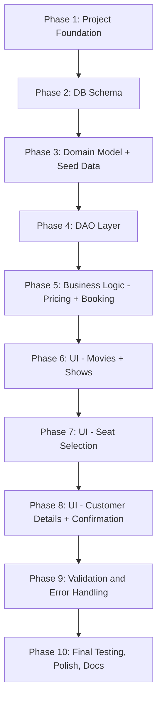

# Roadmap — Dependency Graph

```mermaid
flowchart TD
    P1[Phase 1: Project Foundation] --> P2[Phase 2: DB Schema]
    P2 --> P3[Phase 3: Domain Model + Seed Data]
    P3 --> P4[Phase 4: DAO Layer]
    P4 --> P5[Phase 5: Business Logic - Pricing + Booking]
    P5 --> P6[Phase 6: UI - Movies + Shows]
    P6 --> P7[Phase 7: UI - Seat Selection]
    P7 --> P8[Phase 8: UI - Customer Details + Confirmation]
    P8 --> P9[Phase 9: Validation and Error Handling]
    P9 --> P10[Phase 10: Final Testing, Polish, Docs]
```

Each phase produces a working, committable, pushable increment. No phase may begin before the previous one is committed and pushed.
