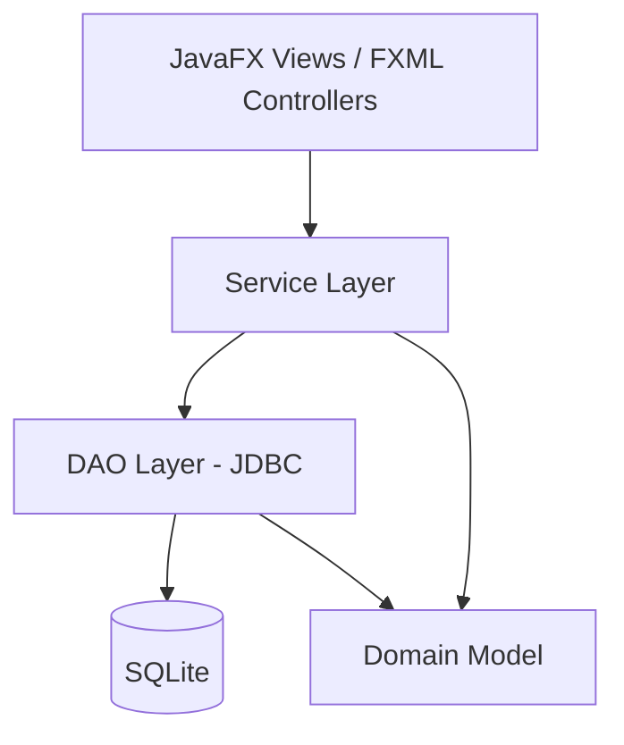

# System Architecture

## High-Level Architecture



Strict one-way dependency: **UI → Service → DAO → Database**. Controllers never talk to DAOs directly, and DAOs never contain business rules (e.g., duplicate-seat logic lives in `BookingService`, not in `SeatDao`).

## Why This Architecture
- Matches the confirmed stack (JavaFX + plain JDBC, no ORM) without introducing frameworks not confirmed by the user.
- Keeps business logic (pricing, duplicate-seat prevention) testable with JUnit without needing a running UI.
- Small enough for an academic project; layered enough to cleanly demonstrate OOP (interfaces for DAOs and pricing strategies, inheritance for Person/Customer).

## Package Structure

```text
com.moviebooking
├── MainApp.java                 // JavaFX entry point
├── model/                       // Domain/entity classes
│   ├── Movie.java
│   ├── Theatre.java
│   ├── Show.java
│   ├── Seat.java
│   ├── Person.java              // abstract
│   ├── Customer.java            // extends Person
│   ├── Booking.java
│   └── Ticket.java
├── dao/                         // Data access (interfaces + SQLite impls)
│   ├── MovieDao.java / SqliteMovieDao.java
│   ├── TheatreDao.java / SqliteTheatreDao.java
│   ├── ShowDao.java / SqliteShowDao.java
│   ├── SeatDao.java / SqliteSeatDao.java
│   └── BookingDao.java / SqliteBookingDao.java
├── service/                     // Business logic
│   ├── MovieService.java
│   ├── BookingService.java
│   ├── PricingStrategy.java     // interface
│   ├── StandardPricing.java
│   └── WeekendPricing.java
├── db/
│   ├── DatabaseManager.java     // connection + schema init
│   └── SeedData.java
├── util/
│   └── BookingIdGenerator.java
└── controller/                  // JavaFX FXML controllers (Phase 6+)
    ├── HomeController.java
    ├── MovieListController.java
    ├── ShowSelectionController.java
    ├── SeatSelectionController.java
    ├── CustomerDetailsController.java
    └── ConfirmationController.java
```

## Class Responsibilities

See `component-design.md` for the full per-class table (fields/methods/relationships/OOP concept).

## Dependency Direction Rules
- `model/` has no dependencies on any other package (pure data + minimal behavior).
- `dao/` depends on `model/` and `db/` only.
- `service/` depends on `dao/` and `model/` only — never on `controller/` or JavaFX classes.
- `controller/` depends on `service/` only — never directly on `dao/`.
- `db/` has no dependencies on `service/` or `controller/`.

This prevents the common academic-project mistake of UI code calling SQL directly.

## Error Handling Strategy
- **DAO layer:** catches `SQLException`, wraps in an unchecked `DataAccessException` (custom), never lets raw `SQLException` leak into services/UI.
- **Service layer:** performs business validation (e.g., seat already booked → throws `SeatUnavailableException`; invalid input → `ValidationException`). Services never show UI dialogs themselves.
- **Controller layer:** catches service-layer exceptions and translates them into user-facing JavaFX alerts/messages. Controllers never contain business rules.

## Database Access Approach
Plain JDBC (via `java.sql`) with the SQLite JDBC driver (`org.xerial:sqlite-jdbc`). No ORM/JPA/Hibernate — confirmed as the simplest appropriate approach per the technical decisions.
