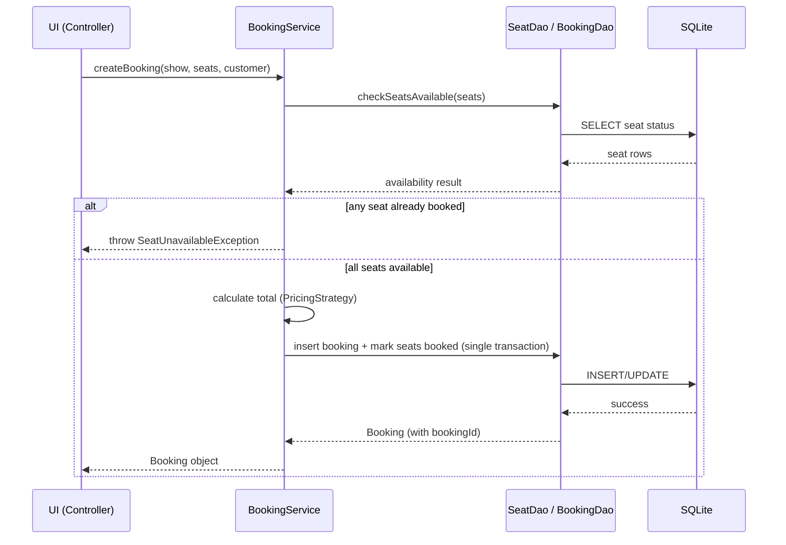

# Booking Flow

```mermaid
sequenceDiagram
    participant UI as UI (Controller)
    participant SVC as BookingService
    participant DAO as SeatDao / BookingDao
    participant DB as SQLite

    UI->>SVC: createBooking(show, seats, customer)
    SVC->>DAO: checkSeatsAvailable(seats)
    DAO->>DB: SELECT seat status
    DB-->>DAO: seat rows
    DAO-->>SVC: availability result
    alt any seat already booked
        SVC-->>UI: throw SeatUnavailableException
    else all seats available
        SVC->>SVC: calculate total (PricingStrategy)
        SVC->>DAO: insert booking + mark seats booked (single transaction)
        DAO->>DB: INSERT/UPDATE
        DB-->>DAO: success
        DAO-->>SVC: Booking (with bookingId)
        SVC-->>UI: Booking object
    end
```

Booking insert and seat-marking happen in a single JDBC transaction (commit/rollback together) so the system never ends up with a booking row but unmarked seats, or vice versa.
