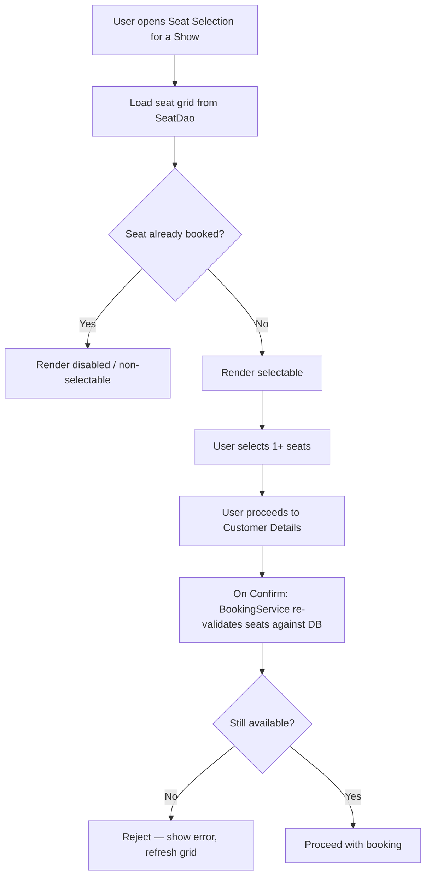

# Seat Selection & Duplicate-Seat Validation Flow

This two-stage check (UI-level disabling + service-level re-validation at commit time) is what actually satisfies FR-007/NFR-004 — the UI disabling alone is a convenience, not the enforcement mechanism.
