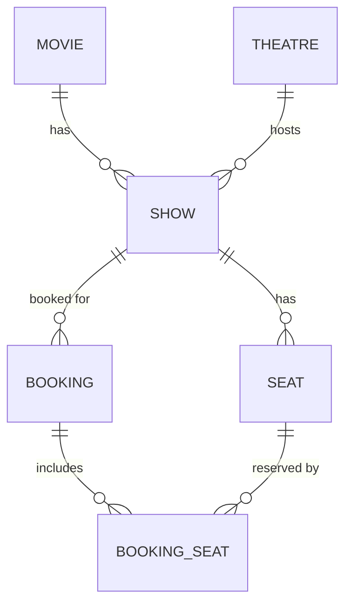

# Database Schema (DDL)

```sql
CREATE TABLE movie (
    id INTEGER PRIMARY KEY AUTOINCREMENT,
    title TEXT NOT NULL,
    genre TEXT NOT NULL,
    base_price REAL NOT NULL,
    duration_minutes INTEGER NOT NULL
);

CREATE TABLE theatre (
    id INTEGER PRIMARY KEY AUTOINCREMENT,
    name TEXT NOT NULL,
    location TEXT,
    screen_count INTEGER NOT NULL
);

CREATE TABLE show (
    id INTEGER PRIMARY KEY AUTOINCREMENT,
    movie_id INTEGER NOT NULL REFERENCES movie(id),
    theatre_id INTEGER NOT NULL REFERENCES theatre(id),
    show_datetime TEXT NOT NULL,   -- ISO-8601
    screen_number INTEGER NOT NULL
);

CREATE TABLE seat (
    id INTEGER PRIMARY KEY AUTOINCREMENT,
    show_id INTEGER NOT NULL REFERENCES show(id),
    row_label TEXT NOT NULL,
    column_number INTEGER NOT NULL,
    booked INTEGER NOT NULL DEFAULT 0,   -- 0 = false, 1 = true
    UNIQUE(show_id, row_label, column_number)
);

CREATE TABLE booking (
    id INTEGER PRIMARY KEY AUTOINCREMENT,
    booking_code TEXT NOT NULL UNIQUE,   -- human-facing Booking ID
    show_id INTEGER NOT NULL REFERENCES show(id),
    customer_name TEXT NOT NULL,
    customer_phone TEXT NOT NULL,
    total_cost REAL NOT NULL,
    created_at TEXT NOT NULL             -- ISO-8601
);

CREATE TABLE booking_seat (
    booking_id INTEGER NOT NULL REFERENCES booking(id),
    seat_id INTEGER NOT NULL REFERENCES seat(id),
    PRIMARY KEY (booking_id, seat_id)
);
```

## ER Diagram



## Seed Data (implemented in Phase 3)

`SeedData.seedIfEmpty()` runs one transaction only when `movie` is empty.

### Movies
| Title | Genre | Base Price | Duration |
|---|---|---|---|
| The Last Horizon | Sci-Fi | 180.0 | 128 min |
| Midnight Echoes | Thriller | 160.0 | 112 min |
| Beyond the Blue | Adventure | 140.0 | 136 min |

### Theatre
| Name | Location | Screens |
|---|---|---|
| CineNova Grand | City Center | 3 |

### Shows
`firstShowDate` is the local date on which the database is first seeded, plus one day.

| Date | Time | Movie | Screen |
|---|---|---|---|
| firstShowDate | 10:00 | The Last Horizon | 1 |
| firstShowDate | 14:00 | Midnight Echoes | 2 |
| firstShowDate + 1 day | 11:00 | Beyond the Blue | 1 |
| firstShowDate + 1 day | 17:00 | The Last Horizon | 2 |
| firstShowDate + 2 days | 13:00 | Midnight Echoes | 3 |
| firstShowDate + 2 days | 19:00 | Beyond the Blue | 1 |

### Seats
- 5 rows: `A`, `B`, `C`, `D`, `E`
- 6 columns per row: `1` through `6`
- 30 seats per show, 180 seats total
- All seats start with `booked = 0`
