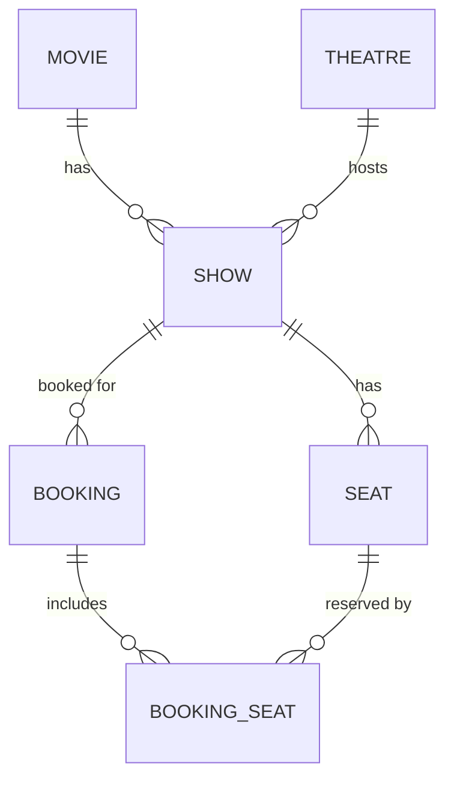

# Database Schema (DDL)

```sql
CREATE TABLE movie (
    id INTEGER PRIMARY KEY AUTOINCREMENT,
    title TEXT NOT NULL,
    genre TEXT NOT NULL,
    base_price REAL NOT NULL,
    duration_minutes INTEGER NOT NULL
);

CREATE TABLE theatre (
    id INTEGER PRIMARY KEY AUTOINCREMENT,
    name TEXT NOT NULL,
    location TEXT,
    screen_count INTEGER NOT NULL
);

CREATE TABLE show (
    id INTEGER PRIMARY KEY AUTOINCREMENT,
    movie_id INTEGER NOT NULL REFERENCES movie(id),
    theatre_id INTEGER NOT NULL REFERENCES theatre(id),
    show_datetime TEXT NOT NULL,   -- ISO-8601
    screen_number INTEGER NOT NULL
);

CREATE TABLE seat (
    id INTEGER PRIMARY KEY AUTOINCREMENT,
    show_id INTEGER NOT NULL REFERENCES show(id),
    row_label TEXT NOT NULL,
    column_number INTEGER NOT NULL,
    booked INTEGER NOT NULL DEFAULT 0,   -- 0 = false, 1 = true
    UNIQUE(show_id, row_label, column_number)
);

CREATE TABLE booking (
    id INTEGER PRIMARY KEY AUTOINCREMENT,
    booking_code TEXT NOT NULL UNIQUE,   -- human-facing Booking ID
    show_id INTEGER NOT NULL REFERENCES show(id),
    customer_name TEXT NOT NULL,
    customer_phone TEXT NOT NULL,
    total_cost REAL NOT NULL,
    created_at TEXT NOT NULL             -- ISO-8601
);

CREATE TABLE booking_seat (
    booking_id INTEGER NOT NULL REFERENCES booking(id),
    seat_id INTEGER NOT NULL REFERENCES seat(id),
    PRIMARY KEY (booking_id, seat_id)
);
```

## ER Diagram



## Seed Data (Phase 3)
Small fixed dataset: a handful of movies, 1-2 theatres, several shows, and generated seat rows per show (e.g., 5 rows x 6 columns = 30 seats/show). Exact titles/names are placeholders unless the user specifies real ones (see `assumptions-and-constraints.md`).
