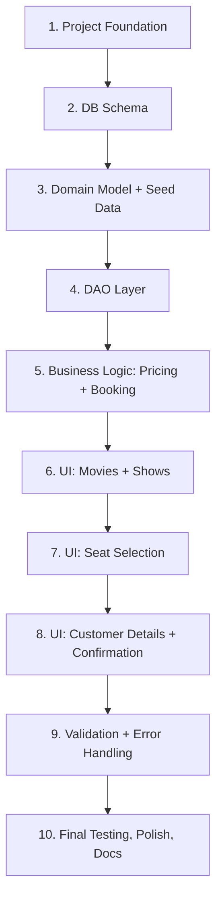

# FINAL PLAN — Movie Ticket Booking System
**Single-document master plan for executing the entire project.**
*(Detailed backing documents live under `docs/` — this file is the one-stop summary + execution order. If anything here conflicts with `docs/13-reference/memory.md`, memory.md wins, since it is updated live during implementation.)*

---

## 1. What We're Building
A Java 17 + JavaFX desktop app that lets a user browse movies, pick a show, select seats on a live grid, enter their details, and get a confirmed booking with a generated Booking ID — all backed by a local SQLite database that survives restarts. It's also an academic OOP project: inheritance and polymorphism are used because they solve real design problems (see §7), not as decoration. The UI is held to a genuinely polished, premium bar — closer to a real consumer booking app than a bare-bones form — without adding scope beyond the 6 confirmed screens.

## 2. Confirmed Decisions (frozen — do not change without recording it in memory.md first)
| | |
|---|---|
| Language | Java 17 |
| GUI | JavaFX |
| Build | Maven |
| Database | SQLite, plain JDBC (no ORM) |
| Testing | JUnit 5 |
| Auth | None — single-user local app |
| Payment | Not implemented |
| VIP seats | Not implemented |
| Ticket output | On-screen only |
| Admin UI | Not implemented |
| Repo | https://github.com/adithya-1010010/BookShow.git |

## 3. Architecture (one paragraph)
Strict one-way layering: **JavaFX Controllers → Services → DAOs → SQLite**. Controllers hold no business logic; Services hold no SQL; DAOs hold no business rules. Duplicate-seat prevention is enforced at the database layer (conditional `UPDATE ... WHERE booked = 0` inside a transaction), not just in the UI. Full detail: `04-architecture/architecture.md`.

## 4. OOP At a Glance
- **Class/Object:** every entity (Movie, Theatre, Show, Seat, Booking, Ticket, Customer).
- **Inheritance:** `Person` (abstract) → `Customer` — genuine shared-identity hierarchy.
- **Polymorphism:** `PricingStrategy` interface → `StandardPricing` / `WeekendPricing`, called uniformly by `BookingService`.
Detail: `07-oop/oop-design.md`.

## 5. Database At a Glance
6 tables: `movie`, `theatre`, `show`, `seat`, `booking`, `booking_seat`. Full DDL + ER diagram: `08-database/schema.md`.

## 6. UI Direction
Dark, cinematic theme with one confident accent color; card-based movie browsing; a well-designed seat grid with a clear available/selected/booked legend; one shared stylesheet; subtle transitions. Goal: feel like a polished, modern booking app, executed within pure JavaFX/CSS — no new screens or libraries. Detail: `09-ui/ui-design.md`.

## 7. Execution Order (10 Phases — one at a time, each ending in a commit + push)



| # | Phase | Deliverable | Spec |
|---|---|---|---|
| 1 | Project Foundation | App launches to a blank Home screen | `12-phases/phase-01.md` |
| 2 | DB Schema | SQLite schema auto-created on startup | `12-phases/phase-02.md` |
| 3 | Domain Model + Seed Data | Models + idempotent seed data | `12-phases/phase-03.md` |
| 4 | DAO Layer | Full read/write access per entity | `12-phases/phase-04.md` |
| 5 | Business Logic | Pricing + booking rules, fully unit-tested | `12-phases/phase-05.md` |
| 6 | UI: Movies + Shows | Styled browse + show selection | `12-phases/phase-06.md` |
| 7 | UI: Seat Selection | Styled, interactive seat grid | `12-phases/phase-07.md` |
| 8 | UI: Customer + Confirmation | Full flow completes, styled confirmation | `12-phases/phase-08.md` |
| 9 | Validation & Error Handling | App can't be crashed by normal misuse | `12-phases/phase-09.md` |
| 10 | Final Testing & Polish | Full regression, docs reconciled, README done | `12-phases/phase-10.md` |

## 8. Per-Phase Lifecycle (mandatory, identical every time)
```
Read memory.md + architecture.md + this phase's spec
  → Implement ONLY this phase
  → Run this phase's tests
  → Manually verify Expected Result
  → Update docs touched by this phase
  → Update memory.md (mark COMPLETE, record decisions/discoveries)
  → git add . && git commit -m "phase-NN: ..." && git push
  → STOP (do not auto-continue to next phase)
```

## 9. Anti-Hallucination Rules (apply to every phase, every session)
1. Never invent a requirement beyond `context.md` / `02-requirements/requirements.md`.
2. Never silently change architecture/tech stack — check `memory.md` first.
3. If genuinely ambiguous, STOP and record it in memory.md's "Open Questions" rather than guessing.
4. Don't implement future-phase work early; don't rewrite working components unnecessarily.
5. Document every deviation in `memory.md`.

## 10. Open Items to Resolve During Implementation (not blocking, but must be recorded when decided)
- Exact seed dataset content (Phase 3)
- Exact Booking ID format (Phase 5)
- Exact weekend-pricing rule/surcharge (Phase 5)

## 11. Definition of Done
- All 10 phases COMPLETE in `memory.md`, each with its own pushed commit.
- Full JUnit suite passes together.
- Full manual walkthrough works end-to-end, styled consistently per `09-ui/ui-design.md`.
- Duplicate-seat booking is provably impossible (TC-005 passes).
- Booking persists correctly across an app restart (TC-010 passes).
- `README.md` and all `docs/` are accurate and reconciled with the final code.

## 12. Where Everything Lives
```
docs/01-overview/        → human-friendly project intro
docs/02-requirements/    → FR/NFR with IDs, traceable to phases
docs/03-planning/        → plan.md, roadmap.md, phases.md, implementation-plan.md (OpenCode's execution doc)
docs/04-architecture/    → architecture, packages, classes, tech stack
docs/05-flows/           → Mermaid flow diagrams (system, booking, seat, confirmation)
docs/06-modules/         → one doc per functional module
docs/07-oop/             → class/inheritance/polymorphism justification
docs/08-database/        → schema, ER diagram, seed data plan
docs/09-ui/              → screen specs + the "premium UI" design direction
docs/10-testing/         → strategy, phase-by-phase test plan, TC-IDs
docs/11-development/     → coding guidelines, git workflow
docs/12-phases/          → phase-01.md ... phase-10.md, fully detailed
docs/13-reference/       → memory.md (READ FIRST), glossary, troubleshooting, future-improvements
docs/FINAL-PLAN.md       → this file
```

**Start point for implementation: `docs/13-reference/memory.md`, then `docs/12-phases/phase-01.md`.**
